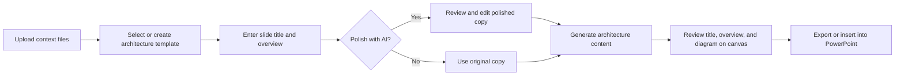

# Architecture Slide Title and Overview — Design

Status: Proposed
Audience: Product, design, and engineering
Scope: Architecture diagram workflow

## Summary

Add a guided step to the architecture diagram workflow that asks the user for:

1. A slide title.
2. Overview text describing the main message of the slide.

The user can ask AI to polish both entries, review and edit the result, and see the final text rendered on the selected slide template before exporting to PowerPoint.

The recommended implementation adds a dedicated **Slide Content** step after a template is selected and before the architecture diagram is generated. It uses a small, purpose-built AI request for copy polishing and template-owned placeholders for reliable title and overview placement.

## Open Questions

These questions should be answered before implementation is considered complete. None prevents review of this initial design because the document provides a recommended default for each.

| Question | Why it matters | Recommended default |
| --- | --- | --- |
| Does this apply only to manually selected templates, or also to AI-selected and AI-created diagrams? | The application has three ways to reach the canvas, and inconsistent behavior would be confusing. | Apply it to all three paths. Ask for narrative content after a template is selected or a generated diagram is available. |
| Where should the overview box appear on each template? | Current template JSON does not include a semantic overview box, and the multi-application template uses nearly the full slide width. | Create a narrative-ready version of every template with a common title area and overview panel. Store placement in template JSON, not runtime geometry guesses. |
| Is the overview a paragraph, bullets, or either? | This affects the AI prompt, formatting schema, height calculations, and PowerPoint output. | V1 supports one short paragraph of 2–4 sentences. Add bullet support later if research shows a need. |
| Should AI use uploaded diligence files while polishing? | Files may improve specificity but add latency, cost, and risk of introducing claims the user did not intend. | V1 polishes only the user-provided title and overview, with the selected template name as light context. It must not add facts. |
| Is AI polishing required or optional? | Required AI would block users when the API is unavailable and removes direct author control. | Make polishing optional. Users can continue with their original text. |
| Must both fields be completed? | Optional fields complicate layout and can lead to incomplete slides. | Require both fields before generating the slide. |
| What length limits should apply? | Text must fit consistently in PowerPoint and the browser canvas. | Title: 120 characters. Overview: 600 characters, with a target of 300–450 characters. Enforce the maximum and show a counter. |
| Should the original and polished versions both be retained? | Users need a safe way to compare, revert, and avoid losing their wording. | Retain both in page state until the user leaves the workflow; provide “Use original” after polishing. |
| Does “slide title” replace the diagram’s internal title, such as “Product Architecture”? | Existing templates contain an architecture-container label but no standard executive slide headline. | Add a separate executive slide title. Keep the internal diagram label as part of the architecture visualization. |
| Should narrative text persist after refresh or across sessions? | The current application keeps diagram state only in React memory. | Match current behavior in V1: session-only state. Treat persistence as a separate feature. |

## Goals

- Prompt for a title and overview during architecture slide creation.
- Help the user improve clarity, concision, grammar, and executive tone using AI.
- Preserve the user’s facts and intended meaning.
- Let the user edit the polished result before continuing.
- Render the accepted title and overview on the selected template in the browser.
- Include the accepted text in new PowerPoint exports and slides inserted into existing decks.
- Support manual template selection, AI template selection, and create-new-diagram mode.
- Keep the architecture-generation prompt and narrative-polishing prompt independent.

## Non-goals

- Generating a title or overview from nothing.
- Fact-checking the user’s narrative against source documents.
- Creating multiple alternative narratives in V1.
- Rich-text editing, bullet indentation, or per-word formatting.
- Saving drafts to a server or sharing them between users.
- Changing authentication, API-key handling, or broader application persistence.
- Replacing the existing technical-label generation workflow.

## Current State

The application currently:

- Holds workflow state and route orchestration in `src/App.tsx`.
- Selects templates in `src/pages/SlidePickerPage.tsx`.
- Immediately calls `generateSlidePromptOutput` after manual template selection.
- Uses `src/lib/modelSelector.ts` for AI template selection.
- Uses `src/lib/diagramGenerator.ts` for create-new-diagram mode.
- Sends structured requests through `src/lib/OpenAI.ts`.
- Renders slide JSON through `src/lib/slide-flow/SlideFlowCanvas.tsx`.
- Exports the same JSON through `src/lib/export`.

The bundled architecture templates are all 1280 × 720, but their content regions differ:

- Most templates place the diagram in approximately the left 800 pixels, leaving room for a right-hand overview panel.
- `multi-app-arch.json` uses nearly the full slide width and needs a deliberate narrative-ready layout.
- Existing title-like elements are labels inside the architecture diagram. They are not a consistent executive slide headline.
- No template currently identifies an element as the overview box.

This means narrative placement should be explicit in each template rather than inferred by element text, coordinates, or element ordering.

## Proposed User Experience

### End-to-end flow



### Slide Content page

Add a route such as `/diagram-content` with a new `SlideContentPage`.

The page should use a two-column layout on desktop:

- Left: title and overview inputs, validation, character counters, and actions.
- Right: a scaled, read-only preview of the selected template with the current title and overview applied.

On smaller screens, show the form first and the preview beneath it.

Suggested controls:

- **Slide title** — single-line input.
- **Overview** — multiline input.
- **Polish with AI** — sends the current fields to the polishing endpoint.
- **Use original** — appears after polishing and restores the user’s submitted wording.
- **Generate slide** — accepts the currently visible values and continues.
- **Back to template** — returns without losing the draft.

### Interaction details

- Keep both fields editable before and after polishing.
- Update the slide preview as the user types; do not require an AI call to preview text.
- Disable **Polish with AI** when either field is empty or a request is in progress.
- Disable **Generate slide** when either field is empty, over its maximum length, or an AI request is in progress.
- Do not automatically replace text when an AI request begins.
- When polishing succeeds, place the polished text into the editable fields and retain the original values for a one-click revert.
- When polishing fails, preserve the current text and allow the user to proceed without AI.
- If the user edits polished text, treat the edited result as the accepted version.
- Show a visible loading state only within the content form; the full-page snail loader is unnecessary for this shorter interaction.

## Functional Requirements

### Input and validation

| Field | Required | Recommended limit | Validation |
| --- | --- | --- | --- |
| Slide title | Yes | 120 characters | Trim leading/trailing whitespace; reject empty or over-limit values. |
| Overview | Yes | 600 characters | Trim leading/trailing whitespace; reject empty or over-limit values. Preserve intentional paragraph breaks if later supported. |

Validation must run both in the UI and immediately before applying the narrative to slide JSON.

### AI polishing behavior

The AI should:

- Preserve all factual claims, qualifications, company names, product names, and numbers.
- Improve clarity, grammar, concision, and executive readability.
- Keep the title suitable for a slide headline.
- Keep the overview within the configured length limit.
- Return exactly one polished title and one polished overview.
- Avoid introducing technologies, findings, risks, recommendations, or conclusions not present in the user’s text.
- Return structured JSON rather than free-form prose.

The AI should not receive the entire slide JSON. Narrative polishing is a copy-editing operation and should have a narrow input and output contract.

## Data Model

Add a dedicated type rather than storing these values as unstructured prompt text:

```ts
export type SlideNarrative = {
  title: string
  overview: string
}

export type SlideNarrativeDraft = {
  original: SlideNarrative
  current: SlideNarrative
  source: 'user' | 'ai' | 'user-edited-ai'
}
```

Recommended application state in `App.tsx`:

```ts
const [pendingTemplate, setPendingTemplate] = useState<DiagramTemplate | null>(null)
const [slideNarrativeDraft, setSlideNarrativeDraft] =
  useState<SlideNarrativeDraft | null>(null)
```

`pendingTemplate` separates template choice from generation. The accepted `current` narrative is applied after architecture JSON generation so the architecture AI cannot overwrite it.

## Template Contract

### Recommended approach: semantic template elements

Update every narrative-ready architecture template to contain these elements:

- `slide-narrative-title`
- `slide-narrative-overview-box`
- `slide-narrative-overview-text`

The title and overview text should be normal supported `text` elements. The overview background should be a supported rectangular `shape` element. Their typography, colors, spacing, and coordinates belong to the template JSON.

Example:

```json
{
  "id": "slide-narrative-title",
  "type": "text",
  "x": 48.33,
  "y": 48,
  "w": 1180,
  "h": 72,
  "fill": "FFFFFF",
  "stroke": "FFFFFF",
  "strokeWidth": 0,
  "text": "Architecture Overview",
  "align": "left",
  "valign": "middle",
  "fontSize": 28,
  "fontFace": "Arial",
  "textColor": "060150",
  "runs": [
    {
      "text": "Architecture Overview",
      "color": "060150",
      "fontFace": "Arial",
      "fontSize": 28,
      "bold": true
    }
  ]
}
```

The exact styling must be created by adapting the existing West Monroe slide assets and PowerPoint styling conventions. The example above demonstrates identity, not final visual values.

### Why semantic elements are preferred

- Placement is reviewed visually once per template.
- The application does not rely on fragile text matching.
- Text and PowerPoint rich-text runs can be updated deterministically.
- The React Flow canvas and PowerPoint exporter already understand text and shape elements.
- Template-specific layout differences remain under template control.
- Future templates can opt in by satisfying the same contract.

### Template layout work

Each of the six templates needs a narrative-layout review:

1. Add the executive title above the main content region.
2. Add a right-side overview panel where space already exists.
3. Keep the internal architecture title inside the diagram.
4. Ensure the overview panel does not overlap diagram elements.
5. Resize or rearrange the multi-application diagram to reserve overview space.
6. Render every updated template to PowerPoint and visually verify it at 100% scale.

Do not implement a runtime “find empty space” algorithm in V1. It would be difficult to make reliable across new templates and would produce differences between browser and PowerPoint rendering.

## Narrative Application

Create `src/lib/slideNarrative.ts` with one public operation:

```ts
export function applySlideNarrative(
  input: unknown,
  narrative: SlideNarrative,
): SlidePromptOutput
```

Responsibilities:

1. Clone the input JSON.
2. Validate and normalize the narrative.
3. Find the semantic title and overview text elements by exact ID.
4. Update each element’s `text`.
5. Synchronize `runs[].text` without altering formatting.
6. Update `presentation.title` and the first slide’s `name` from the accepted title.
7. Return the updated object.
8. Throw a clear template-contract error if required elements are missing.

The helper should not change coordinates, dimensions, colors, fonts, or unrelated text.

### Ordering with existing AI generation

Apply the narrative last:

```text
selected template
  → architecture technical-label generation
  → apply accepted slide narrative
  → canvas review
  → branded PowerPoint export
```

This avoids expanding `SlideTextOnlyPrompt.md` and prevents the architecture-generation request from rewriting user-approved narrative text.

For create-new-diagram mode, first produce the generated architecture JSON, then adapt it to a narrative-ready layout before applying the accepted text. If generated diagrams cannot reliably reserve the overview region, V1 should disable narrative support for create mode rather than allow overlap. This is the one workflow area most dependent on the final layout decision.

## AI API Design

Add:

- `src/prompts/SlideNarrativePolishPrompt.md`
- `src/types/SlideNarrative.ts`
- `polishSlideNarrative` in a focused module such as `src/lib/slideNarrativePolisher.ts`

Suggested request:

```ts
type PolishSlideNarrativeParams = {
  narrative: SlideNarrative
  templateName: string
}
```

Suggested structured response:

```json
{
  "title": "Concise Executive Architecture Title",
  "overview": "A polished overview that preserves the user's facts and intended meaning."
}
```

The JSON schema should:

- Require exactly `title` and `overview`.
- Disallow additional properties.
- Enforce string types.

The client must still validate response lengths because JSON Schema string-length support may vary by model/API behavior and does not replace application validation.

### Prompt principles

The system prompt should tell the model:

- Act as an executive technology-diligence copy editor.
- Preserve meaning and evidence strength.
- Do not add facts.
- Do not turn uncertainty into certainty.
- Do not invent risks or recommendations.
- Prefer active voice and concise language.
- Return JSON only.

The user message should include the original title, original overview, configured limits, and selected template name.

## Application Flow Changes

### `src/App.tsx`

- Add `/diagram-content`.
- Add `pendingTemplate` and narrative draft state.
- Change manual template submission to select the template and navigate to the content page instead of immediately calling OpenAI.
- Split the current `handleSubmitTemplate` into:
  - `handleSelectTemplate`
  - `handleAcceptNarrativeAndGenerate`
- Route AI-selected templates through the same content step.
- Decide how create-new-diagram mode obtains a narrative-compatible layout before enabling the content step.
- Apply accepted narrative after technical diagram generation and before setting `canvasTemplate`.

### `src/pages/SlidePickerPage.tsx`

- Rename the action from **Submit** to **Continue**.
- Keep file attachments associated with the current session.
- Pass only the selected template to the parent; generation moves to the next step.

### New `src/pages/SlideContentPage.tsx`

- Own field-level UI state or receive a controlled draft from `App.tsx`.
- Display validation and counters.
- Call the AI polishing operation.
- Build a preview JSON by calling `applySlideNarrative` on the selected template.
- Render the preview using `SlideFlowCanvas` in read-only mode.
- Submit the accepted narrative to the parent.

### `src/lib/slide-flow/SlideFlowCanvas.tsx`

Add an explicit read-only mode if one does not already exist:

```ts
type SlideFlowCanvasProps = {
  readOnly?: boolean
  // existing properties
}
```

In read-only mode, disable dragging, resizing, editing, node addition, and change callbacks while preserving fit-to-view behavior.

### `src/pages/TemplateCanvasPage.tsx`

- No major export changes should be required because narrative elements live in slide JSON.
- The title and overview will be editable on the existing canvas if text editing is supported for their element type.
- Optionally add an **Edit slide content** action that returns to `/diagram-content` with the accepted draft.

### Template files

Update all files in `src/lib/export/json-slide-templates`.

Also update their preview PNGs in `src/arch-picker` so the picker accurately represents the narrative-ready layout. Alternatively, render previews dynamically from JSON in a later change; static preview replacement is lower risk for V1.

## Error Handling

| Failure | Expected behavior |
| --- | --- |
| AI polishing request fails | Keep the user’s current text, show a non-destructive error, and allow continuation. |
| AI returns invalid JSON | Treat as a polishing failure; do not replace user text. |
| AI returns over-limit text | Reject the response or trim only after explicit user review; recommended behavior is to show an error and preserve the prior text. |
| Template lacks narrative placeholders | Block generation for that template with an actionable template-contract error. |
| Architecture generation fails | Keep the selected template and narrative draft so the user can retry. |
| User navigates back | Preserve field values and uploaded files in React state. |
| Export fails | Existing export behavior remains unchanged; narrative remains visible on the canvas. |

## Accessibility

- Associate visible labels, help text, counters, and errors with each field.
- Announce AI request completion and failure through an `aria-live` region.
- Preserve keyboard navigation and visible focus states.
- Do not use color alone to distinguish original and polished text.
- Respect the existing reduced-motion behavior.
- Ensure the scaled preview has a useful accessible label; its individual canvas nodes should not create excessive screen-reader noise in read-only mode.

## Testing Strategy

The repository does not currently include an automated test framework. This feature should introduce at least unit tests for deterministic JSON manipulation. Vitest fits the existing Vite/TypeScript stack.

### Unit tests

Test `applySlideNarrative` for:

- Correct title and overview replacement.
- Correct synchronization of element text and rich-text runs.
- Preservation of all unrelated JSON.
- Updating presentation title and slide name.
- Whitespace normalization.
- Missing-placeholder errors.
- Empty and over-limit input errors.
- No mutation of the source object.

Test narrative response parsing for:

- Valid structured response.
- Missing fields.
- Additional fields.
- Empty strings.
- Over-limit strings.

### Component tests

- Both fields are required.
- Counters and validation messages update.
- Preview reflects current input.
- AI success replaces editable values.
- **Use original** restores the original values.
- AI failure preserves user text and does not block generation.
- Back/forward navigation preserves the draft.

### Integration tests

- Manual template → content → AI polish → generation → canvas.
- Manual template → content → no AI → generation → canvas.
- AI-selected template follows the same content step.
- Create-new-diagram behavior follows the selected scope decision.
- Exported `.pptx` contains the accepted title and overview.
- Inserted slide contains the accepted title and overview.

### Visual regression and PowerPoint QA

For every architecture template:

- Render the empty/default narrative state.
- Render maximum-length title and overview samples.
- Confirm no overlap or clipping in the browser.
- Export to `.pptx` and inspect the rendered slide.
- Confirm consistent typography, padding, and line wrapping.
- Verify the multi-application template after its layout adjustment.

## Telemetry

If product telemetry is available later, useful events are:

- `slide_narrative_started`
- `slide_narrative_polish_requested`
- `slide_narrative_polish_succeeded`
- `slide_narrative_polish_failed`
- `slide_narrative_original_restored`
- `slide_narrative_accepted`

Do not log the title, overview, or uploaded document content. Record only operational metadata such as template ID, duration, result, and character counts.

## Security and Privacy

The current application calls OpenAI directly from the browser. This feature should not broaden the data sent to the model:

- Send only title, overview, and template name for polishing.
- Do not send slide JSON or uploaded files unless a later product decision explicitly requires evidence-aware rewriting.
- Do not log narrative content.
- Preserve current error handling without exposing request payloads.

The broader browser-exposed API key architecture remains a production concern but is outside this feature’s scope.

## Rollout Plan

### Phase 1 — Template and JSON foundation

- Define narrative types and semantic element IDs.
- Create narrative-ready versions of all templates.
- Add and test `applySlideNarrative`.
- Update picker preview images.

### Phase 2 — User workflow

- Add the Slide Content route and page.
- Add validation, live preview, and draft preservation.
- Route manual template selection through the new page.

### Phase 3 — AI polishing

- Add the polishing prompt and structured response schema.
- Add polish, retry, failure, and restore-original states.

### Phase 4 — Remaining entry paths and export QA

- Route AI-selected templates through the new page.
- Implement the agreed create-new-diagram behavior.
- Complete browser and PowerPoint visual QA for all templates.

## Acceptance Criteria

- The user is prompted for a title and overview before an architecture slide is generated.
- Both fields are required and enforce the agreed limits.
- The user can continue without using AI.
- The user can request an AI-polished version of both fields.
- AI failure does not erase input or block the non-AI path.
- The user can edit polished text and restore the original text.
- The selected template preview displays the current title and overview.
- The final canvas displays the accepted title and overview without overlap.
- New and inserted PowerPoint slides include the accepted title and overview.
- All six bundled templates satisfy the narrative-placeholder contract.
- Existing architecture technical-label generation continues to work.
- Unrelated slide JSON is unchanged when narrative text is applied.

## Recommended Decisions for V1

To make the first implementation cohesive and low risk:

1. Apply the feature to manual and AI-selected templates; include create mode only after its layout strategy is proven.
2. Use a dedicated Slide Content page with live preview.
3. Require both fields.
4. Support a short paragraph overview, not bullets.
5. Make AI polishing optional and preserve the original.
6. Polish only user-provided text; do not send diligence files.
7. Add explicit semantic title and overview elements to every template.
8. Apply narrative text after architecture AI generation.
9. Add Vitest unit coverage for JSON transformation before changing the workflow.
