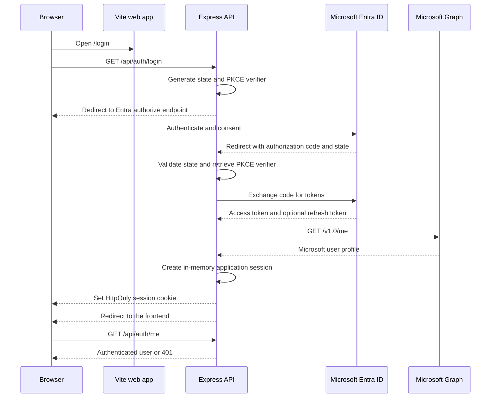

# Microsoft Entra sign-in flow

This document describes the Microsoft Entra ID sign-in flow implemented by Diligence Studio. It is
intended for developers reviewing, configuring, or extending the authentication implementation.

## What the flow does

Diligence Studio uses a server-side OAuth 2.0 authorization-code flow with PKCE:



The browser never receives the Microsoft client secret, access token, or refresh token. The API
owns the OAuth exchange and stores the resulting session data in server memory.

## Implementation locations

| Responsibility | File |
| --- | --- |
| Express auth route registration | `server/src/app.ts` |
| Entra redirects, token exchange, Graph profile lookup, sessions, and cookies | `server/src/auth/microsoftAuth.ts` |
| Frontend session bootstrap and protected route redirects | `web/src/App.tsx` |
| Sign-in button | `web/src/pages/LoginPage.tsx` |
| Logout button and request | `web/src/components/AppNav.tsx` |
| Local `/api` proxy | `web/vite.config.ts` |
| Local configuration template | `.env.example` |

## Required Entra app registration

Create an app registration in Microsoft Entra ID with these settings:

1. Register a confidential web application.
2. Add the exact local redirect URI:

   ```text
   http://localhost:43127/api/auth/callback
   ```

3. Create a client secret and copy the secret **value**, not the secret identifier.
4. Add delegated Microsoft Graph permissions:

   - `User.Read`
   - `Files.Read`
   - `Sites.Read.All`
   - OpenID scopes used by the authorization request: `openid`, `profile`, `email`, and
     `offline_access`

5. Grant admin consent if the tenant requires it, especially for `Sites.Read.All`.

The default tenant value is `organizations`, which allows work or school accounts from organizational
tenants. Set `MICROSOFT_TENANT_ID` to a specific tenant ID when the application must be limited to one
tenant.

The redirect URI must match the value sent during both authorization and token exchange. A mismatch
usually produces an `AADSTS50011` redirect URI error from Entra.

## Environment configuration

Copy the example file and fill in the server-side values:

```sh
cp .env.example .env
```

Relevant settings:

| Variable | Required | Default | Purpose |
| --- | --- | --- | --- |
| `MICROSOFT_TENANT_ID` | No | `organizations` | Entra tenant ID or tenant alias |
| `MICROSOFT_CLIENT_ID` | Yes | — | Application/client ID from the app registration |
| `MICROSOFT_CLIENT_SECRET` | Yes | — | Confidential client secret value; server-only |
| `MICROSOFT_REDIRECT_URI` | No | `http://localhost:43127/api/auth/callback` | OAuth callback registered in Entra |
| `MICROSOFT_FRONTEND_ORIGIN` | No | `http://localhost:5173` | Redirect target after login or auth failure |
| `MICROSOFT_SUPPORT` | No | `false` | Enables Microsoft support and server-side protection for `/api/v1` |
| `MICROSOFT_COOKIE_SECURE` | No | `true` | Adds the `Secure` cookie attribute; set `false` only for local HTTP development |

The root command loads `.env`:

```sh
npm run dev
npm run api
```

The Vite app runs on port `5173` and proxies `/api/*` to the API on port `43127`. The API's default
port comes from `server/src/config.ts` and can be changed with `PORT`; if it is changed, update the
Vite proxy target and Entra redirect URI as well.

Do not put `MICROSOFT_CLIENT_SECRET` in a `VITE_*` variable. Values beginning with `VITE_` are
embedded into browser JavaScript and are not secret.

## Request-by-request behavior

### 1. The user opens the login page

The frontend route is `/login`. `App.tsx` first calls:

```text
GET /api/auth/me
```

The request includes browser credentials. While this request is pending, the app displays the loading
state. A `401` means the user is not signed in, so the login page remains available. A successful
response contains the normalized application user:

```json
{
  "authenticated": true,
  "user": {
    "email": "person@example.com",
    "id": "microsoft-object-id",
    "name": "Person Name"
  }
}
```

### 2. The user starts sign-in

Clicking **Sign in with Microsoft** navigates the browser to:

```text
GET /api/auth/login
```

The API validates `MICROSOFT_CLIENT_ID` and `MICROSOFT_CLIENT_SECRET`, then generates:

- a cryptographically random `state` value;
- a random PKCE `code_verifier`;
- a SHA-256 PKCE `code_challenge` derived from the verifier.

The API stores the state and verifier in the process-local pending authorization map for 10 minutes.
It then redirects the browser to the Entra authorization endpoint using:

```text
response_type=code
response_mode=query
code_challenge_method=S256
scope=openid profile email offline_access User.Read Files.Read Sites.Read.All
```

### 3. Entra authenticates the user

The user signs in at Microsoft and grants consent if required. Entra redirects to the registered
callback:

```text
GET /api/auth/callback?code=...&state=...
```

The callback rejects missing, unknown, or expired state values. It also removes a consumed state from
the pending map before exchanging the code, which prevents a successful code/state pair from being
reused by this process.

If the user cancels or Entra returns an authorization error, the API redirects back to `/login` with
a user-safe `authError` query parameter. The frontend displays that message in the login panel.

### 4. The API exchanges the code

The server posts the authorization code, PKCE verifier, client ID, client secret, redirect URI, and
requested scopes to the tenant-specific Entra token endpoint:

```text
https://login.microsoftonline.com/{tenant}/oauth2/v2.0/token
```

The response is narrowed to the values the application needs. Provider response bodies and token
values are not returned to the browser or written to logs.

### 5. The API resolves the user

Using the access token, the API calls Microsoft Graph:

```text
GET https://graph.microsoft.com/v1.0/me?$select=id,displayName,mail,userPrincipalName
```

The application requires an `id` and an email address. It prefers `mail` and falls back to
`userPrincipalName`. The resulting application user contains only `id`, `name`, and `email`.

### 6. The API creates the application session

After Graph succeeds, the API creates a random session ID and stores this server-side record:

```text
session ID -> access token, token expiry, optional refresh token, normalized user
```

The session ID is sent as this cookie:

```text
diligence_studio_session=<random-value>; HttpOnly; Path=/; SameSite=Lax; Max-Age=28800; Secure
```

`Secure` is enabled by default and may be disabled only for local HTTP development with
`MICROSOFT_COOKIE_SECURE=false`. The API then redirects the browser to
`MICROSOFT_FRONTEND_ORIGIN`, normally `http://localhost:5173`.

### 7. The frontend gates the application routes

After the redirect, `App.tsx` calls `/api/auth/me` again. If the session is valid, the user can access
the diagramming, commentary, JSON input, and canvas routes. If not, protected frontend routes redirect
to `/login`.

When `MICROSOFT_SUPPORT=true` is enabled in the server environment, the same session is required by
the versioned `/api/v1` routes. When it is false, those routes retain the anonymous demo behavior.
The SharePoint routes are available only when the server-side flag is enabled and always require a
valid Microsoft session.

## Session refresh

`getMicrosoftAccessToken()` looks up the session from the request cookie. If the access token expires
within 60 seconds, it uses the stored refresh token to request a replacement access token from Entra
and updates the in-memory session.

The helper is available for future Microsoft Graph-backed server endpoints. The current template,
import, and export routes do not yet call it, so the sign-in flow currently establishes an application
session but does not itself retrieve SharePoint files.

If a session has no refresh token after its access token expires, the helper removes the session and
returns an authentication error. A user must sign in again.

## Logout

The navigation bar sends:

```text
POST /api/auth/logout
```

The API removes the session ID from the in-memory map and expires the browser cookie. The browser then
reloads `/login`, which causes the next `/api/auth/me` request to return `401`.

## Route reference

| Method | Route | Behavior |
| --- | --- | --- |
| `GET` | `/api/auth/login` | Starts Entra authorization and redirects to Microsoft |
| `GET` | `/api/auth/callback` | Validates the callback, exchanges the code, creates a session, and redirects to the frontend |
| `GET` | `/api/auth/me` | Returns the current normalized user or `401` |
| `POST` | `/api/auth/logout` | Removes the server session and expires the cookie |

The auth routes are mounted by the testable Express app in `server/src/app.ts`. They are separate from
the versioned PowerPoint API routes under `/api/v1`.

## Current security and operational limitations

These are important review points for anyone extending the flow:

- The application session and pending OAuth state are process-local. A server restart signs users
  out, and multiple API instances need shared session storage before production scaling.
- The access and refresh tokens are kept in server memory. They are not persisted, returned to the
  browser, or logged.
- `SameSite=Lax` supports the top-level OAuth callback while reducing cross-site cookie sending. Use
  HTTPS outside local development; secure cookies are the default.
- The implementation does not yet enforce an allowed email domain or tenant-specific authorization
  rule beyond the Entra tenant selected by `MICROSOFT_TENANT_ID`. If access must be restricted to
  West Monroe users or groups, enforce that policy on the server after identity is established.
- Pending OAuth states and sessions are bounded and expired entries are pruned during auth requests,
  but they remain process-local and are not shared across API instances.
- The client-side `session` value is navigation state only. It is not an identity proof and must not
  be used as authorization data by a server endpoint.

## Troubleshooting

| Symptom | Likely cause | Check |
| --- | --- | --- |
| Entra reports `AADSTS50011` | Callback URI mismatch | Compare the Entra redirect URI and `MICROSOFT_REDIRECT_URI` exactly, including port and path |
| `/api/auth/login` returns a configuration error | Missing client credentials | Set `MICROSOFT_CLIENT_ID` and `MICROSOFT_CLIENT_SECRET` in the API environment |
| Browser cannot reach `/api/auth/me` | API is not running or Vite proxy is wrong | Start `npm run api` and confirm the API listens on `43127` |
| Login succeeds but the app returns to `/login` | Cookie is not being set or the API session was lost | Inspect the response `Set-Cookie`, confirm browser/API origins, and check whether the API restarted |
| Sign-in is cancelled | User or tenant denied authorization | The callback redirects to `/login?authError=...`; retry after reviewing consent requirements |
| Graph lookup fails | Missing `User.Read`, consent, or an unusable profile email | Check delegated permissions and tenant consent; the API requires Graph `id` and email data |
| `Sites.Read.All` consent is blocked | Tenant admin consent is required | Ask a tenant administrator to grant consent or adjust the requested Graph permissions |

## Review checklist

Before enabling this flow for a shared or production environment, review:

- the server-side `MICROSOFT_SUPPORT` flag matches the web build flag;
- tenant, group, and email-domain authorization rules;
- persistent, encrypted, or otherwise managed session storage;
- HTTPS, secure cookies, trusted proxy configuration, and CSRF protections;
- token refresh failure handling and revocation behavior;
- shared, durable session storage before running multiple API instances;
- automated tests for auth route responses without calling live Entra or Graph services;
- the minimum Graph scopes required by the features actually being implemented.
